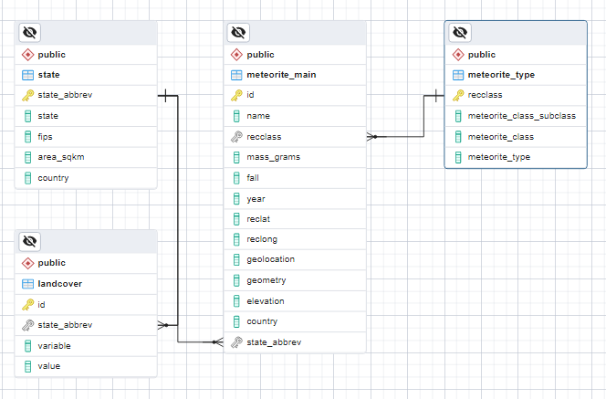
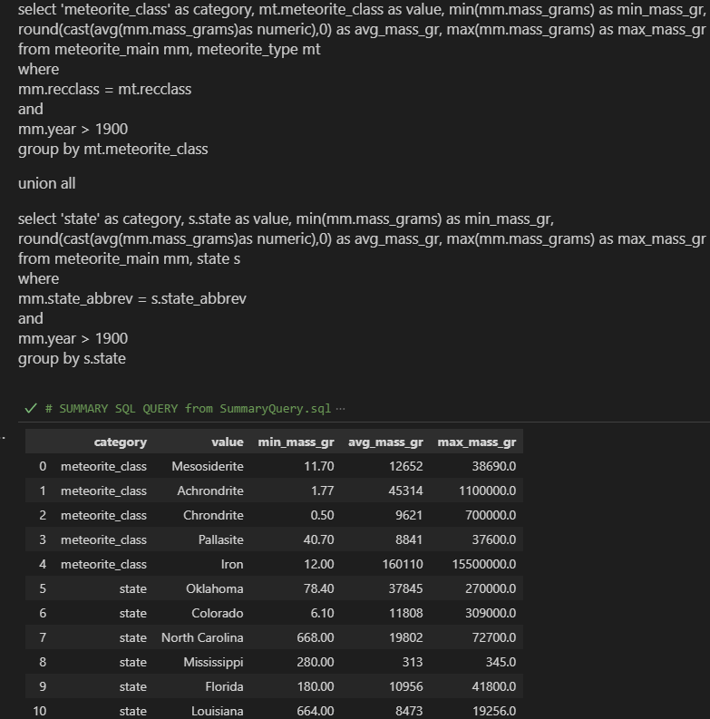
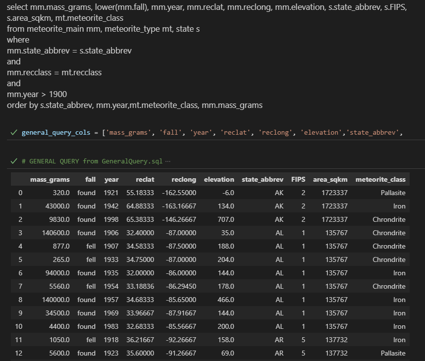

# Meteorite_SQL_ML_Demo

##  **SQL Demonstration Summary**  

###  ***Step 1: Recreated simple database from bootcamp project on Render*** 

###  ***Step 2: Wrote SQL queries to incorporate the following functions:*** 
* group by with aggregate functions
* Union all
* time range (simple - year)
* cast
* Round results
* column alias
* multi-table join (default - inner)
* lowercase
* order by
* limit to 20 results
        
#### Summary Query

#### General Query

Query code available in "meteorite_SQL_chris.ipynb"

###  ***Step 3: Next steps - create more complex DB and queries to illustrate experience with:*** 
time ranges using datetime, trim, substring, like, wildcards, operators 

####  DB reference:

https://github.com/ChristyGruen/meteorite-ml-project

 
 

------
##  **ML Exploration**  

###  ***Machine learning exploration of data from the meteorite-ml-project*** 

Query code and analyses available in "meteorite_ml_chris.ipynb"

